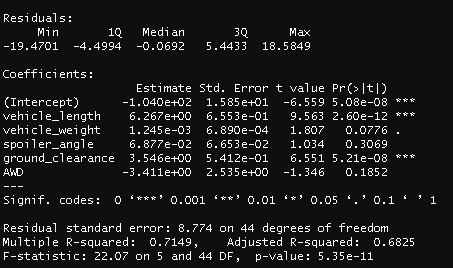
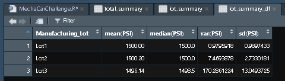
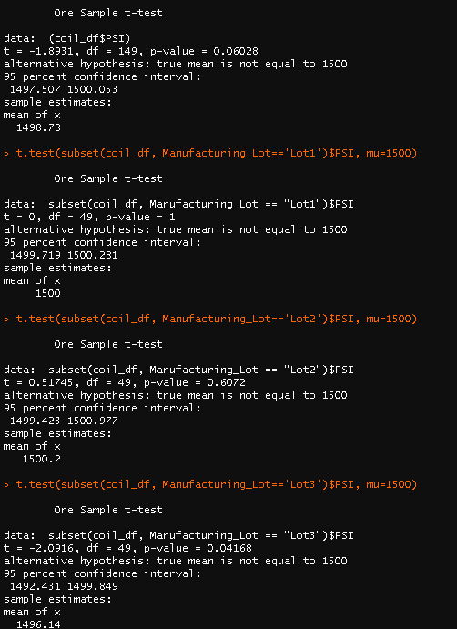

# MechaCar_Statistical_Analysis

## DELIVERABLE 1
## Linear Regression to Predict MPG

### 1. Which variables/coefficients provided a non-random amount of variance to the mpg values in the dataset?
Vehicle length and ground clearance provide non-random variance to the dataset. 

### 2. Is the slope of the linear model considered to be zero? Why or why not?
No, it would not be considered to be zero due to the R-squared value being 0.7149 which means that roughly 71% of the variablilty of our dependent variable (MPG) is explained using this linear model. In addition, the p-value of our linear regression analysis is 5.35 x 10-11, which is much smaller than our assumed significance level of 0.05%. Therefore, we can state that there is sufficient evidence to reject our null hypothesis, which means that the slope of our linear model is not zero.

### 3. Does this linear model predict mpg of MechaCar prototypes effectively? Why or why not?
No, this linear model does not predict MPG of MechaCar prototypes effectively.  There appears to still be variables not included in this analysis that account for ~30% of the linear model. Determining and including those variables would make this model more effective.  

## DELIVERABLE 2
## Summary Statistics on Suspension Coils

### The design specifications for the MechaCar suspension coils dictate that the variance of the suspension coils must not exceed 100 pounds per square inch. Does the current manufacturing data meet this design specification for all manufacturing lots in total and each lot individually? Why or why not?

In Total:

Each Lot:

In total, these manufacturing lots meet the criteria of not exceeding 100 PSI with a value of 62.29. The individual lots to not all meet the criteria.  Lot 3 has a variance of 170.29 PSI which does not meet the specifications.  

## DELIVERABLE 3
## T-Tests on Suspension Coils

The PSI across all manufacturing lots, Lot 1, and Lot were found to have a p-values of 0.06028, 1, and 0.6072 which are all  greater than 0.05 therefore we cannot reject that the PSI across all manufacturing lots, lot 1, and lot 2 are not significantly different than the population mean of 1500. Lot 3 had a p-value of 0.04168 which is less than 0.05 which rejects that lot 3 PSI and population PSI are not significantly different.  

## DELIVERABLE 4
## Study Design: MechaCar vs Competition
### Design a statistical study to compare performance of the MechaCar vehicles against performance of vehicles from other manufacturers.
### 1. What metric or metrics are you going to test?
What type of car is being compared plays a role in what would be beneficial to test.  If looking at family sedans, quarter mile speed likely isn't of interest for that consumer but safety rating would be.  For the purpose of this study it will be assumed that the car is a family car and will look at safety rating.

### 2. What is the null hypothesis or alternative hypothesis?
Null= The safety rating of MechaCar's car is not safer than the competitor's cars.

Alternative = The safety rating of MechaCar's car is safer than the competitor's cars.  

### 3. What statistical test would you use to test the hypothesis? And why?

We could use Two-Sample t-Testing to compare MechaCar's safety ratings to each of the competitor's safety ratings.  Safey would be the variable being tested and the data type is continuous. 

### 4. What data is needed to run the statistical test?

In order to run the test we would need safety rating data for the various competitors as well as MechaCar's safety ratings.  
